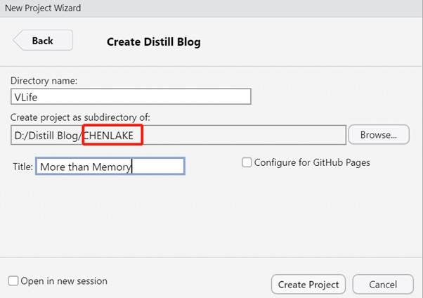

## 0. Clear Buzz-words first !

* **Distill** is a package in R to use **R Markdown** to creat professional-looking blogs. It takes care of all the html-webpage's construction, leaving us only need to focus on how to use Rmarkdown.  
* **Git** is a version control application which helps to track all the modifications of the blog posts.It is quite convenient if we directly use it in Rstudio.    
* **Github** is a cloud app of Git. *Commit*-in-Git, then *push*-to-Github are the successive steps each time we make change to the blog project.    
* **Netlify** is where we can share the blogs with the rest of the world. Each blog project will be assigned a site name in its own domain and most importantly it can connect with Github therefore seamlessly work with Github. _Once we deploy the blog project in Netlify for the first time, each time we make changes or creat new posts, we only need proceed Commit-Push (Git-Github), Netlify will automatically detect the change and update our web pages._  

### 0.1 Distill References  

1 [Distill for R Markdown](https://rstudio.github.io/distill/)  
2. [Reference Guide](https://pkgs.rstudio.com/distill/reference/index.html)  
3. [distilltools](https://ellakaye.github.io/distilltools/)  
4. [The disdillery--customize your sites](https://jhelvy.github.io/distillery/index.html)  
5. [Personalizing the distill template](https://www.ericekholm.com/posts/2021-04-02-personalizing-the-distill-template/)  

## 1. Getting Started
+ install [Git](https://git-scm.com/downloads)  
  + [configure Git in Rstudio](https://r4dsa.netlify.app/posts/2021-05-22-git-in-rstudio/)  
+ register [Github](https://github.com/)  
+ sign up [Netlify](https://www.netlify.com/) and connect with your Github  
+ install R packages in R Studio   

```{r,out.width = "60%", fig.align = "center", echo = FALSE}

```
  + Distill for R Markdown
  + [usethis](https://usethis.r-lib.org/)  


## 2. Structure of Dstill Blog in Rstudio  
```{r,out.width = "60%", fig.align = "center", echo = FALSE}

```

* After creating a distill blog project(*VLife*), the structure of the blog is automatically created, including a *index.Rmd*,a *about.Rmd* and a *welcome.Rmd* ,two folders(_posts, _site) as well as a yaml file(_site.yml)
  + _posts is where we create new blog posts in Rstudio  
  + _site is where Netlify look for the html pages it needs to update 
  
## 3. Steps & Commands  

* _参考Dan心目中的大神 Prof [KAM Tin Seong](https://faculty.smu.edu.sg/profile/kam-tin-seong-486) 教你 [Building a blog with distill for R Markdown](https://r4dsa.netlify.app/posts/2021-05-21-building-a-blog-with-distill-for-r-markdown/)_  

1. In Rstudio, **New Project> Distill Blog**   
 
```{r,out.width = "60%", fig.align = "center", echo = FALSE}

```

  _注意在【New Project Wizard】,put the directory(project)in **subdirectory** which has the same name as Github name(e.g.,CHENLAKE)._  
  
2. Edit and Kit blog page (e.g.,*index.Rmd*) to see the blog html
3. Publish
  + 3.1. Git  
    + In console,input command **usethis::use_git()**    
    + If it is the 1st time to use Git for a newly created project, select <*not now*> for <*commit*>, <*yes*> for <*restart Rstudio*>  
    + Else, in Git pane, select all the modified files then **commit**  
    
  + 3.2. Github  
    + If it is the first time to use Github for a newly created project, in console, input command **usethis::use_github()**  
    + Else, in Git pane, select **push** 
  
  + 3.3. Netlify  
    + It only needs to deploy once (the first time).Point the <*Publish directory*> to  <_site> 
    
```{r,out.width = "60%", fig.align = "center", echo = FALSE}

```

4. Creat new post   
   + input console command **distill::create_post("steps to create distill blog")**  
   + a new folder will appear in <_posts> folder followed by  **Commit** and **Push** in Git pane.
   
```{r,out.width = "60%", fig.align = "center", echo = FALSE}

```

## V 说

> Prof Kam is the one who keeps reminding us to record or document life.  
  I agree.

```{r,out.width = "60%", fig.align = "center", echo = FALSE}

```


