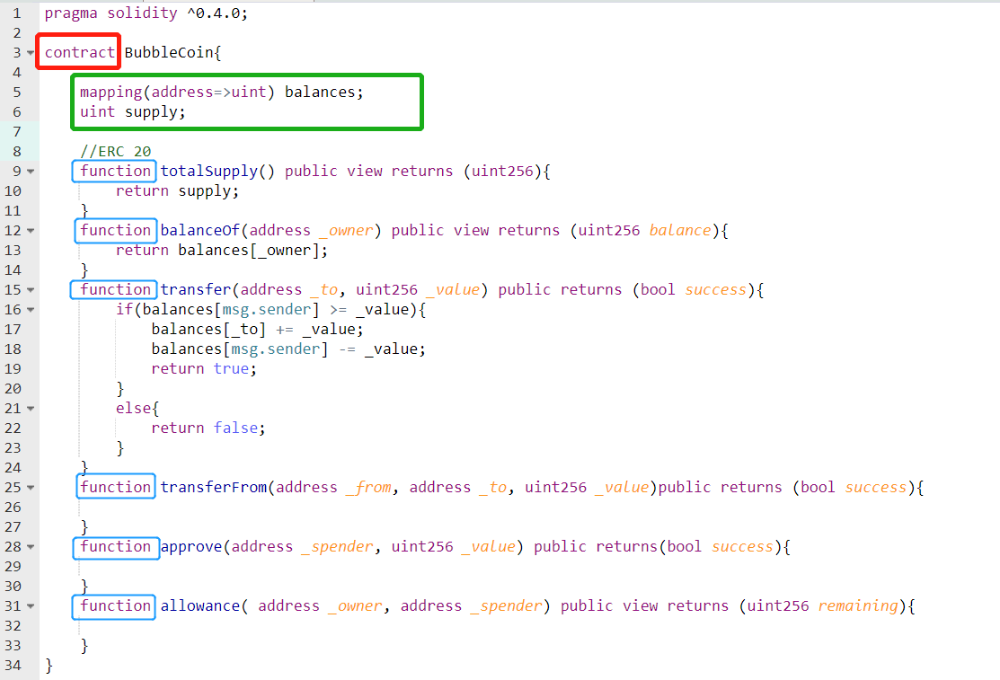
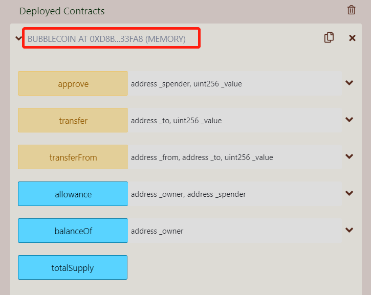

## Blockchain v.s. Protocol v.s. Token  

  Blockchain is a special (cryptographical blocks, chain, immutability, decentralization…) type of data structure or database implemented by a network of nodes who run on the same set of protocols (for example, **`Ethereum` **or **`Bitcoin`** or **`Neo`** etc.,). Its data entries are produced by nodes through a set of rules including consensus.    
  On top of those protocols, the token can be generated by a specific type of smart contract which use the blockchain to record each account’s balance and transaction records. Token can be used to pay for network fees, smart contract deployments and in **`dApp`**(decentralized application) purchases.   

## Smart Contract  

  Smart contract is just a jargon of blockchain, essentially, it is a piece of code, and more specifically, it resembles the **`class`** concept in python and many other programming languages. The main compositions are **`contract data`** and **`functions`** (methods to manipulate the data in the contract).  

```{r,out.width = "80%", fig.align = "center", echo = FALSE}

```

  Once the contract is deployed, it is stored in a place (an address) on blockchain. And other users of this smart contract could use (call) those functions, then the data inside the contract are impacted as a result.     

```{r,out.width = "60%", fig.align = "center", echo = FALSE}


```

## Ethereum Turing Complete   
  First of all, it is talking about smart contract language **`Solidity`** for Ethereum. Solidity is Turing complete.    
  So, what dose it to do with Turing? Well because he designed the theoretical computer which can solve any computational problem, unlike the computing machines before him which were designed specifically for a certain problem, which means if you wanted to compute another set of mathematical problems, you need build another tailored machine. So such a computer which promises to solve any computational problem (though it doesn’t guarantee the time that will take: sooner or later) is regarded as Turing complete.    
 
  If a programing language like Solidity is called TC, it means that you can solve any computational problem using this language. Practically speaking, one feature of a TC language is loop. Bitcoin script language is not TC by its designer, but Ethereum’s is, partly because Bitcoin is solely for payment while Ethereum’s designers want it to be the platform of dApps, which needs to empower its script language more.    
  To avoid people using loop maliciously on blockchain, Ethereum has adopted the idea of **`Gas`** to charge for each computing operation in the smart contract. 


## What’s special about Blockchain

  For applications (codes) running on a server, all clients (the front ends) are only sending requests then the codes are run on a central location (the server). So, the codes are stored and executed centrally.    
  On the other hand, blockchain technology enables codes stored and run in every node of its network (decentralized) and what’s amazing is that blockchain technology can make all those nodes work in **`quantum entanglement` **style, which means once the data on blockchain is successfully modified by one node (by **` Pow`**, **` Pos`** etc), the data stored in other nodes will be updated to reflect the change also. The result will be that the same world state (all information in blockchain at one time) is shared by all nodes in the network of this blockchain.   
  This kind of synchronization made by distributed nodes is achieved by the combination effects of the same set of consensus mechanism, cryptography standards as well as messaging protocols.    

> You can think of a picture that all nodes are surrounding a centered holy tablet ( the distributed ledger aka blockchain ) on which each entry is written after all nodes running the same script (smart contract)and agreeing on one final result (involve consensus and messaging each other). In the protection of HASH, history is created and witnessed by all and immutable ever since. 

     
Finally, if we let our imagination go wilder, we can put the law execution in smart contract to realize the idea of social covenant. What’s special about blockchain technology is that it enables the same rule applies to everyone, not only on concept but also on execution, since the terms will be automatically checked against and trigger the responsive punishment or reward.    

> In this sense, blockchain will make us to reach a state of unprecedented fairness.    


