### API Basics
*[APIs for beginners](https://www.youtube.com/watch?v=GZvSYJDk-us&t=5753s)* 
```{r,out.width = "60%", fig.align = "center", echo = FALSE}
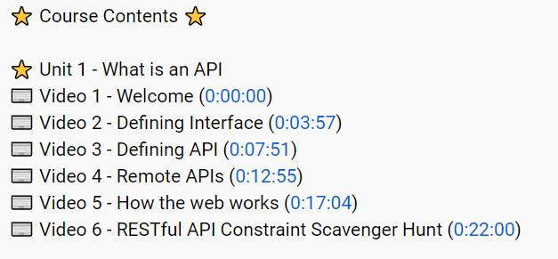
```

### POSTMAN 
*[Postman Beginner's Course - API Testing](https://www.youtube.com/watch?v=VywxIQ2ZXw4&t=3776s)*   
```{r,out.width = "60%", fig.align = "center", echo = FALSE}
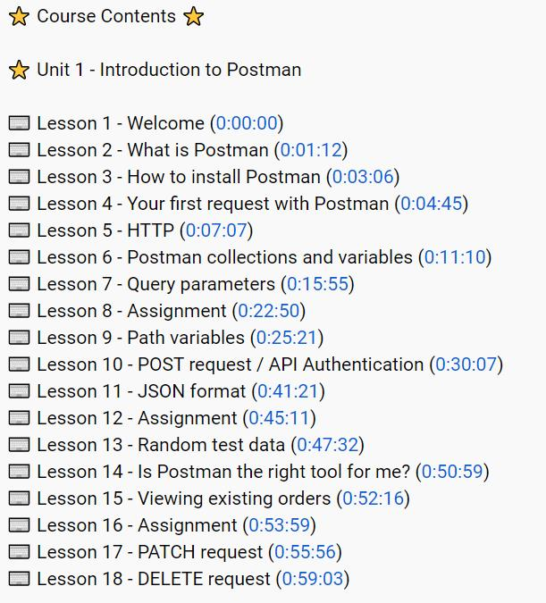
```
1. **Query Parameter**   

> Query Parameter is used to filter what API returned, usually by pointing out the field’s value of returned json.

```{r,out.width = "80%", fig.align = "center", echo = FALSE}
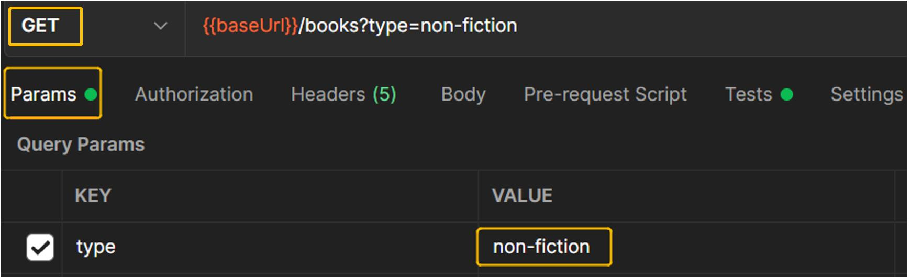
```   
2. **Tests tab**   

> If we want to check/test data of the returned Body, we could filter them in the **Tests** tab (won't change the returned Body, but filter in the "Tests" tab).

- 2.1. We can use **Console.log ()** to see the results of Tests,also can set the result of interest as a global variable for later requests.    

```{r,out.width = "80%", fig.align = "center", echo = FALSE}
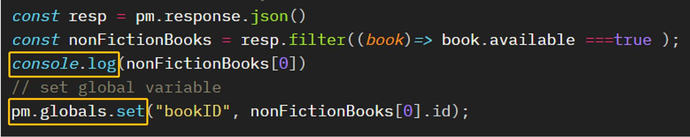
knitr::include_graphics("pics/global_var.jpg")
```   

>  One of the advantage of using POSTMAN `console.log()` is that the returned **Json** file can be viewed in a very clear manner, since the field and value are displayed in different colors.   

```{r,out.width = "70%", fig.align = "center", echo = FALSE}
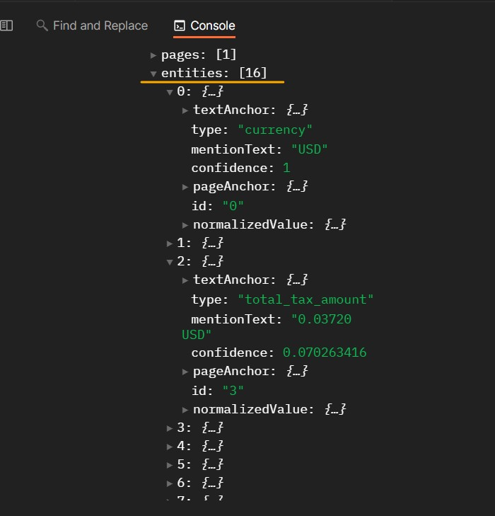
``` 

- 2.2. **pm.test()**   
pm.test( “description string”, callback function-what to test ) is for postman to test the request response. 

```{r,out.width = "80%", fig.align = "center", echo = FALSE}
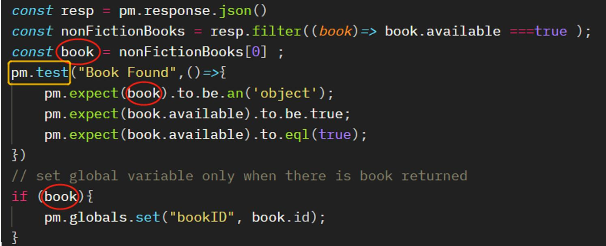
```   

- 2.3. jump a request   

```{r,out.width = "80%", fig.align = "center", echo = FALSE}
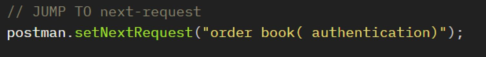
```      

- 2.4. stop   

```{r,out.width = "60%", fig.align = "center", echo = FALSE}
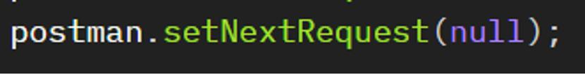
```       

### Postman OAuth2.0 authentication to use Google API   
> Using POSTMAN requires different authentication from using python code which uses Service Accounts and its json key, additional setups are needed to perform:   
1. Register POSTMAN as <mark>Authorised redirect URIs</mark> (web applications)      
2. Register postman as <mark>Authorised domains</mark>    
3. Add <mark>scope</mark> for specific API         

**Setup Steps :**       

1.	Go to Google Cloud Platform and sign in your Google account, select the Project you are in.   
2.	Go to **APIs & Services** and then to **Credentials** > **Create OAuth Client ID**

3.	Select **Web application** for Application type and enter either `https://oauth.pstmn.io/v1/browser-callback`  or `https://oauth.pstmn.io/v1/callback`  for Authorized redirect URLs. This ensures the auth flow works for Postman on both desktop and web. Once you hit **Create** you will see **Client ID** and **Client Secret** - those two values are important (do NOT share with anyone) and we will need them later in Postman.    

4.	Next go to **OAuth consent screen** and enter `oauth.pstmn.io` for **Authorised domains**. For **Scope**, and for **Google cloud API**, ` https://www.googleapis.com/auth/cloud-platform`    

```{r,out.width = "90%", fig.align = "center", echo = FALSE}
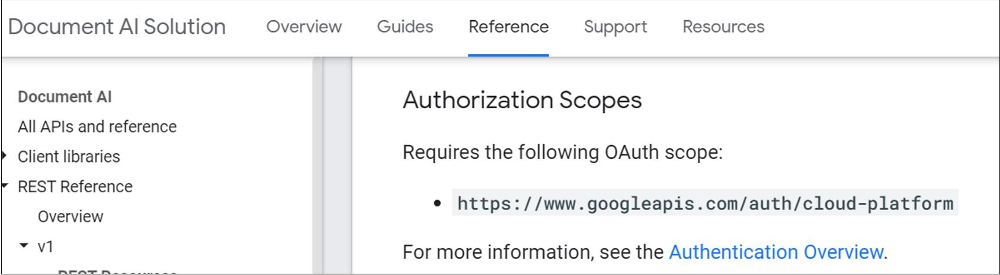
```     
<mark>5</mark>.	Go to postman, and edit the collection for the project. In **Authorization** tab > **Type**,  choose `oAuth 2.0`, the go down to **Configure New Token**, fill in the information and click **Get New Access Token**.      

- For “Auth URL”:  `https://accounts.google.com/o/oauth2/auth   `
- For “Access Token URL”:  `https://accounts.google.com/o/oauth2/token   `
- For “Scope”:  `https://www.googleapis.com/auth/cloud-platform    `
 Then it will open up a web browser window asking for your authentication.

```{r,out.width = "60%", fig.align = "center", echo = FALSE}
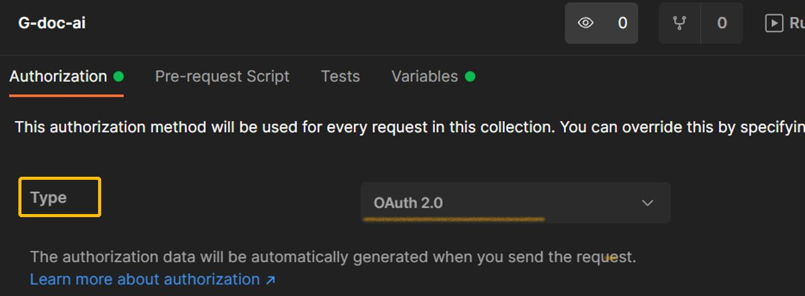    
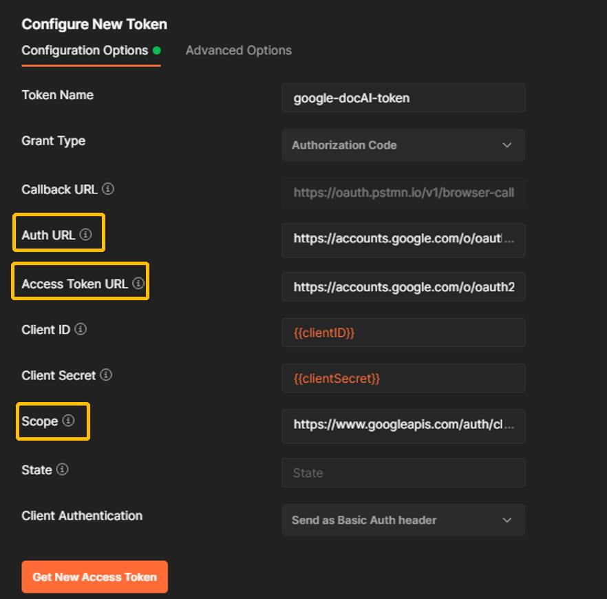
```      

6.	Finally, token will be generated , as below. Those token may expire in some period, when it comes, just repeat the step **5** to get new token.      

```{r,out.width = "60%", fig.align = "center", echo = FALSE}
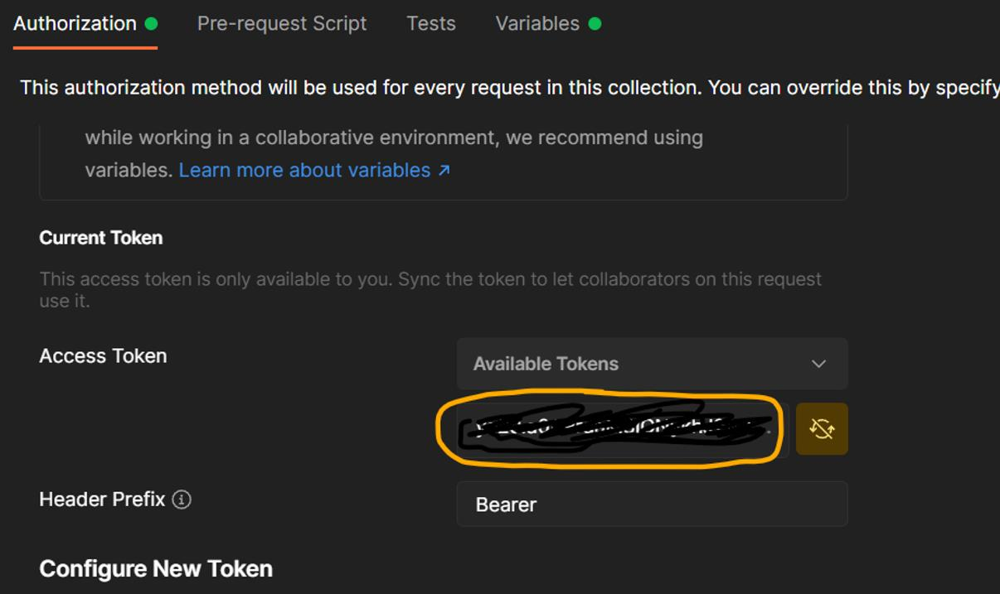
```      

7.	When making request, just choose / inherit the Available Tokens.  

```{r,out.width = "80%", fig.align = "center", echo = FALSE}
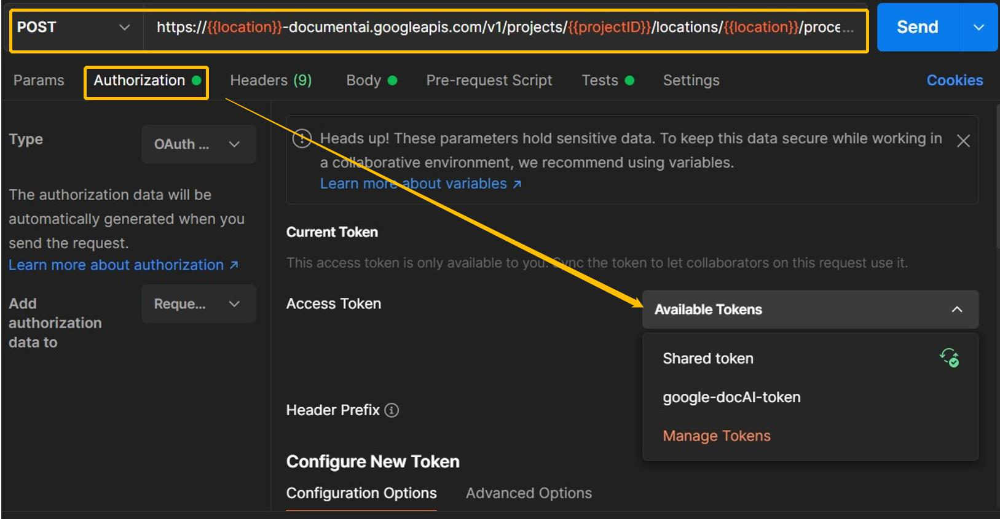
```      


### Send a Google-DOC-AI Processing Request in POSTMAN  
*check [ official reference ](https://cloud.google.com/document-ai/docs/send-request)*     

```{r,out.width = "90%", fig.align = "center", echo = FALSE}
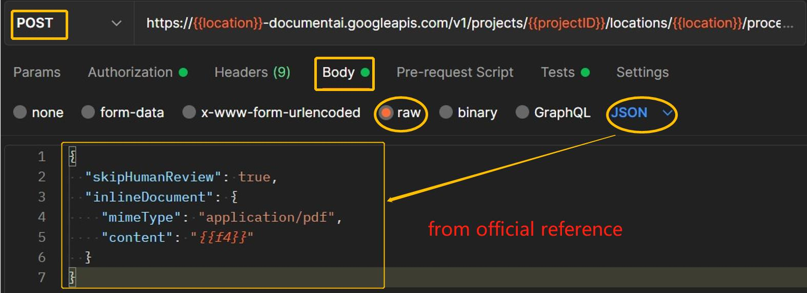
```    

1. **HTTP method and URL:**    
```
POST 
https://LOCATION-documentai.googleapis.com/v1/projects/PROJECT_ID/locations/LOCATION/processors/PROCESSOR_ID:process 
```   
2. **Body**:      
```json
{
  "skipHumanReview": true,
  "inlineDocument": {
    "mimeType": "application/pdf",
    "content": "{{f4}}"
  }
}
```      

  - `Human Review` means [Human In The Loop processor](https://cloud.google.com/document-ai/hitl) which *enables human verification and corrections to ensure accuracy of data extracted by Human in the Loop processors before it is used in critical business applications. It provides a workflow and UI for humans (referred to as labelers in HITL) to review, validate and correct the data extracted from documents by Human in the Loop processors.*    
  - `mimiType` is talking about the **file formats** DOC AI supports:    
    `'application/pdf'` `,'application/json'`, `'image/tiff'`, `'image/gif'`.
  - for `content` we need pass **base64 encoding** (ASCII string) of binary image data into JSON representations. Google also has its [recommended ways](https://cloud.google.com/vision/docs/base64) to do it from which my code also borrowed the core.  
  
```{python, python.reticulate= FALSE,  eval=FALSE}
import base64
# Pass the image data to an encoding function.
def encode_image(image):
  image_content = image.read()
  return base64.b64encode(image_content)

f4 ="CI0000000041.pdf"
file_dir ="C:/V/Google AI doc/invoice_parser/"
PDF_PATH = file_dir + f1 # Update to path of target document
text_dir = file_dir +'base64.txt'
# encode
with open(PDF_PATH, "rb") as image:
    content = encode_image(image)
# get content and use it in POSTMAN
with open(text_dir,"wb") as f:
    f.write(content)
  
```             
> A good way to adduce the content(`{{f4}}`) is to save it as a **global variable**     

```{r,out.width = "90%", fig.align = "center", echo = FALSE}
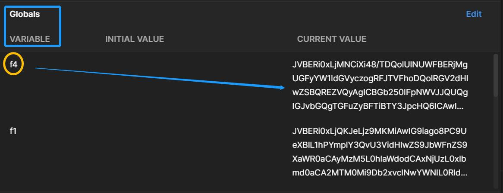
```  

### Test DocAI API in Python   

To evaluate this API's performance on images of **commercial invoice** in customs clearance, I tested over 50 samples(`.pdf` or `.tif` files) using python code as below. The output will be in format of  `.xlsx` for the convenience of further calculation of the **confidence interval** for **population** average accuracy rate.     

```{r, fig.align = "center", echo = FALSE}
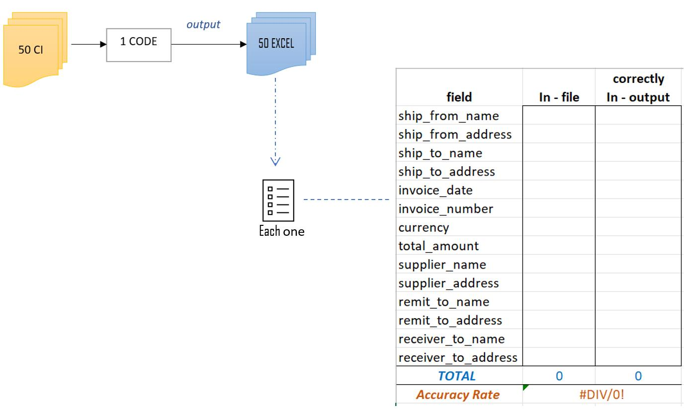
```  

```{python, python.reticulate= FALSE,  eval=FALSE}

import os
import pandas as pd

pd.set_option('max_colwidth', None)
pd.set_option('display.max_columns', None)

"""
refer to  https://cloud.google.com/document-ai/docs/send-request#documentai_process_document-python;
function : to extract feilds relavent to logistic business
"""
from google.cloud import documentai_v1 as documentai
def process_document_sample(
    project_id: str, location: str, processor_id: str, file_path: str
):
    # You must set the api_endpoint if you use a location other than 'us', e.g.:
    opts = {}
    if location == "eu":
        opts = {"api_endpoint": "eu-documentai.googleapis.com"}

    client = documentai.DocumentProcessorServiceClient(client_options=opts)

    # The full resource name of the processor, e.g.:
    # projects/project-id/locations/location/processor/processor-id
    # You must create new processors in the Cloud Console first
    name = f"projects/{project_id}/locations/{location}/processors/{processor_id}"

    with open(file_path, "rb") as image:
        image_content = image.read()

    """ 
    Read the file into memory.  
    'mime_type' can be 'application/pdf', 'image/tiff', 'image/gif', or 'application/json'
    document = {"content": image_content, "mime_type": "image/tiff"}
    """
    
    #chose the right mime_type
    if file_path[-3:] =="pdf" :
        mime ='application/pdf'
    elif file_path[-3:] =="tif":
        mime = "image/tiff"
    else:
        print("mime_type not recognizable")
    
    # Read the file into memory.
    document = {"content": image_content, "mime_type": mime}
    # Configure the process request
    request = {"name": name, "raw_document": document}

    # Recognizes text entities in the PDF document
    result = client.process_document(request=request)

    document = result.document

    print("Document processing complete.{}\n". format(file_path))
    
    # customized Fields to Commercial Invoice of logistic industry 
    entities = document.entities
    not_relevant_types =['line_item','vat','total_tax_amount','receiver_tax_id','supplier_tax_id',
                         'supplier_iban','freight_amount', 'net_amount','supplier_email','supplier_website']
    types,values,confidence = [],[],[]
    
    # Grab relavent fields < key/value > pair and their corresponding confidence scores.
    for entity in entities:
        if ( entity.type_ not in not_relevant_types ):
            types.append(entity.type_)
            values.append(entity.mention_text)
            confidence.append(round(entity.confidence,4))
        else:
            pass 
    # print in tabular format. 
    df = pd.DataFrame({'Type': types, 'Value': values, 'Confidence': confidence})
    return df

# Google Cloud Platform info
jsonkeyDirectory = "C:\\V\\Google AI doc\\xxx"   
googleProjectId = "xx-ea-exp-dev-gcpgogleap-xxx"
googleJsonKey = jsonkeyDirectory + "\\documentaikey.json"
location = 'eu' # Format is 'us' or 'eu'
processor_id = 'xx274e7ff98xx' # Create processor in Cloud Console, here is invoice parser, and HITL disabled

os.environ["GOOGLE_CLOUD_PROJECT"] = googleProjectId
os.environ["GOOGLE_APPLICATION_CREDENTIALS"] = googleJsonKey 

# Test all Samples in one direcotry
samples_dir ="C:\\V\\Google AI doc\\6. Evaluation Framework\\50 CI samples\\"
output_dir ="C:\\V\\Google AI doc\\6. Evaluation Framework\\50 CI fields output\\"
os.chdir(samples_dir)

# input each sample into processor and output a corresponding excel file. 
for f in os.listdir():
    file_path = samples_dir + f
    # read in testing files names and test
    df_fields = process_document_sample(googleProjectId, location, processor_id, file_path)
    excel_name = output_dir + f[0:2]+'.xlsx'  # e.g:excel name will be "01.xlsx"
    df_fields.to_excel(excel_name)
    
print("All Files Test & Output COMPLETED !")
```

### Google Doc AI API References   

```{r,out.width = "41%", fig.align = "center", echo = FALSE}
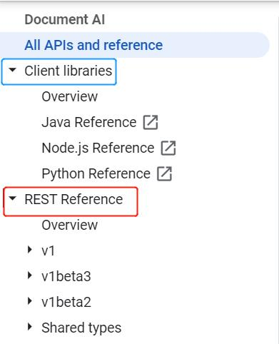
```     

[ Overview ](https://cloud.google.com/document-ai/docs)  
[ How to Guides ](https://cloud.google.com/document-ai/docs/how-to)     
[ Reference ](https://cloud.google.com/document-ai/docs/apis)


