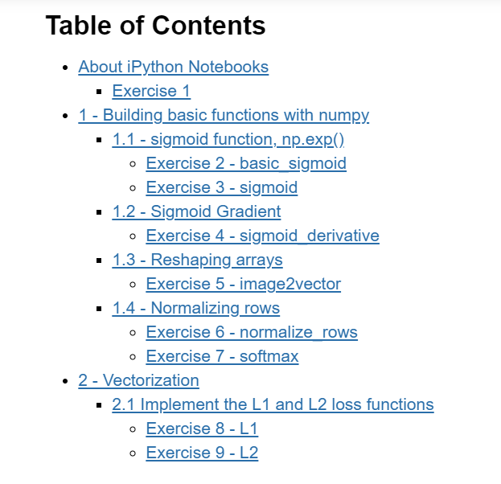
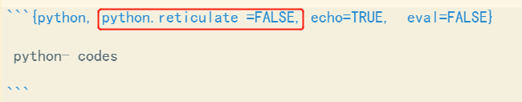

In a R Markdown document, there are mainly 3 elements which are YAML Header, Text Body and Code Chunk.   

[online cheat sheet](https://www.markdownguide.org/cheat-sheet) 

## YAML Header      
### Add Date Manually     
```{r,out.width = "30%", fig.align = "left", echo = FALSE}
knitr::include_graphics("pics/specificDate.png")
```
```yaml
---
title: "Untitled"
author: "V LAKE"
date: "12/17/2021"
output: html_document
---

```
### Add Date Automatically

```{r,out.width = "30%", fig.align = "left", echo = FALSE}
knitr::include_graphics("pics/today.png")
```

```yaml
---
title: "Untitled"
author: "V LAKE"
date: "`r Sys.Date()`"
output: html_document
---
```
```{r,out.width = "60%", fig.align = "left", echo = FALSE}
knitr::include_graphics("pics/timeFormat.png")
```
```yaml
---
title: "Untitled"
author: "V LAKE"
date: " `r format(Sys.time(),'%H:%M:%S %d %b,%Y')` "
output: html_document
---
```

- **Format Options**    

> **Numeric:**      
  `%H` : Hour;  `%M` : Minute;  `%S` : Second;  `%Y` or `%y` : Year; `%m` : Month; `%d` : Day     
  **Text:**      
  `%A` or `%a` : Weekday; `%B` or `%b` : Month(e.g., January or Jan)  

### Add Table-of-Content & CSS 

```{r,out.width = "31%", fig.align = "left", echo = FALSE}
knitr::include_graphics("pics/toc_css.png")
```
```yaml
---
title: "Untitled"
author: "V LAKE"
date: " 12/17/2021 "
output: 
  html_document:
    toc: true
    number_sections: true
    toc_float: true
    toc_depth: 3
    css: style.css
---
```
### Customize fonts and colors      

- Create a text file and name it as `style.css` then link it in YAML header.
- `.css` file should be in the same directory as `.Rmd` file
    
```css
#TOC {
  color: #B8860B;
  font-family: Agency FB;
  font-size: 16px;
  border-color: #708090;
}
#header{
  color:red;
  opacity: 0.8;
}
body{
  color:green;
  font-size: 10px;
}
pre{
  color:blue;
  background-color: #eab676;
}
```
```{r,out.width = "80%", fig.align = "left", echo = FALSE}
knitr::include_graphics("pics/css.png")
```


### Add Parameters

```{r,out.width = "50%", fig.align = "left", echo = FALSE}
knitr::include_graphics("pics/params.png")
knitr::include_graphics("pics/paramPage.png")
```

> Add <` name : value` > under **params:** in YAML header          
  Invoke the parameters in YAML header's **title**, **Text** body and **Code** chunk.

```{r,out.width = "70%", fig.align = "left", echo = FALSE}
knitr::include_graphics("pics/invokeParam1.png")
knitr::include_graphics("pics/invokeParam2.png")
```
## Body 

### set font color

- Using **html** will change the font color in body from now on till end/ next color setting  

```{r, eval=FALSE}
<font color='blue'>
```
### customize Table-of-Content
``` {r, eval=FALSE}
## Table of Contents
- [About iPython Notebooks](#0)
    - [Exercise 1](#ex-1)
- [1 - Building basic functions with numpy](#1)
    - [1.1 - sigmoid function, np.exp()](#1-1)
        - [Exercise 2 - basic_sigmoid](#ex-2)
        - [Exercise 3 - sigmoid](#ex-3)
    - [1.2 - Sigmoid Gradient](#1-2)
        - [Exercise 4 - sigmoid_derivative](#ex-4)
    - [1.3 - Reshaping arrays](#1-3)
        - [Exercise 5 - image2vector](#ex-5)
    - [1.4 - Normalizing rows](#1-4)
        - [Exercise 6 - normalize_rows](#ex-6)
        - [Exercise 7 - softmax](#ex-7)
- [2 - Vectorization](#2)
    - [2.1 Implement the L1 and L2 loss functions](#2-1)
        - [Exercise 8 - L1](#ex-8)
        - [Exercise 9 - L2](#ex-9)
```
```{r,out.width = "70%", fig.align = "left", echo = FALSE}

```

## Plots & Vedios

### Insert pics

```

```

```

```
### Insert pic with R code chunk

```{r,out.width = "80%", fig.align = "left", echo=TRUE, eval= FALSE}
knitr::include_graphics("pics/css.png")
```   

> If using this piece of command inside R code chunk to insert picture,do **insert a space line** between the text and code chunk, otherwise it will reset the format of later text to normal body, even you tried to format it as header or index.  
Frankly speaking, whenever your format doesn't work as you expected, try insert a space line between different formats. 

### Figure arguments

```{r,out.width = "60%", fig.align = "left", echo = FALSE}
knitr::include_graphics("pics/figAlign.png")
```
> **Fig Size**      
  1. `fig.width=` 5,` fig.height =`3  **OR**      
  2. `fig.dim =` c(5,3)  **OR**      
  3. `out.width =`' % ',`out.height =`' %'     
  **Fig Alignment** : ` fig.align = 'left'/'center'/'right' `       
  **Fig Caption** : ` fig.cap = 'xxx' `

### Set Options Globally

- `knitr::opts_chunk$set`( **setting**, echo= TURE)    
- **setting** before `echo =`  is the global settings

```{r,out.width = "60%", fig.align = "left", echo = FALSE}
knitr::include_graphics("pics/globalOpt.png")
```

### Insert Vedio

using HTML5 video tag to insert local files. 
```
<video controls src="../images/animation.m4v"> animation </video>
```
## Add Tables

### by R code chunk

> Use **kable( dataset, args )** in r code chunk.     
  arguments include:         
`col.names = c("col1","col2","col3" ) `      
`align = "ccc" `         
`caption = " " `   
  
```{r,out.width = "70%", fig.align = "left", echo = FALSE}
knitr::include_graphics("pics/table.png")
knitr::include_graphics("pics/tableParams.png")
```

### [Table Generator](https://www.tablesgenerator.com/markdown_tables)     

using online table generator to input the data in the table, preview then copy the code to clipboard to avoid tedious insertion of hypens and pipes. 

```{r,out.width = "60%", fig.align = "left", echo = FALSE}

```

## Code Chunk 

### Options 

```{r,out.width = "60%", fig.align = "left", echo = FALSE}
knitr::include_graphics("pics/chuncOpt.png")
```

> **Code & Output Result **       
  1. **include = FALSE** : show nothing, but run in background .                  
  e.g., import library, dataset / setup global options/ exclude messages         
  2. **echo = FALSE**  : only show result ( no code ), e.g., plotting         
  3. **eval = FALSE** : only show code ( not run, no actual impact by the code )           
  4. **collapse = FALSE**  : combine code & result together in same area (by default, they are separated )      
  **Message,error,warning  Default Value**:        
  1. `warning /message = TRUE`      
  2. `error = FALSE` ( if encounter error, stop knitting )

### Load Packages

```{r,out.width = "60%", fig.align = "left", echo = FALSE}
knitr::include_graphics("pics/loadPack.png")
```

### Interact with Python       
Let's  make it super clear: R Markdown and knitr do support Python.The Python support in R Markdown and knitr is based on the `reticulate` package which allows two-way communication between Python and R.   

> unfortunately, I prefer to use them separately. However, more info can be found [here](https://rstudio.github.io/reticulate/). 

If only for report purpose for which we only want to show the python codes in an R Markdown document, we can add chunk header like this:

```{r, out.width = "80%",fig.align = "left", echo = FALSE}

```

<font color='blue'>
<b>What you need to remember </b>:
    
- Run your cells using SHIFT+ENTER (or "Run cell")
- Write code in the designated areas using Python 3 only
- Do not modify the code outside of the designated areas

<font color='red'>

## Table of Contents
- [About iPython Notebooks](#0)
    - [Exercise 1](#ex-1)
- [1 - Building basic functions with numpy](#1)
    - [1.1 - sigmoid function, np.exp()](#1-1)
        - [Exercise 2 - basic_sigmoid](#ex-2)
        - [Exercise 3 - sigmoid](#ex-3)
    - [1.2 - Sigmoid Gradient](#1-2)
        - [Exercise 4 - sigmoid_derivative](#ex-4)
    - [1.3 - Reshaping arrays](#1-3)
        - [Exercise 5 - image2vector](#ex-5)
    - [1.4 - Normalizing rows](#1-4)
        - [Exercise 6 - normalize_rows](#ex-6)
        - [Exercise 7 - softmax](#ex-7)
- [2 - Vectorization](#2)
    - [2.1 Implement the L1 and L2 loss functions](#2-1)
        - [Exercise 8 - L1](#ex-8)
        - [Exercise 9 - L2](#ex-9)
 


