```{r setup, include=FALSE}
knitr::opts_chunk$set(out.width= "30%",echo = FALSE)
```
In a R Markdown document, there are mainly 3 elements which are YAML Header, Text Body and Code Chunk.   

[online cheat sheet](https://www.markdownguide.org/cheat-sheet) 

## YAML Header      
### Add Date Manually     
```{r,out.width = "30%", fig.align = "left", echo = FALSE}
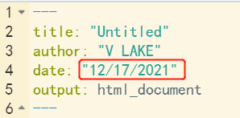
```
```yaml
---
title: "Untitled"
author: "V LAKE"
date: "12/17/2021"
output: html_document
---

```
### Add Date Automatically

```{r,out.width = "30%", fig.align = "left", echo = FALSE}
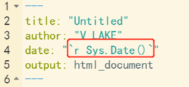
```

```yaml
---
title: "Untitled"
author: "V LAKE"
date: "`r Sys.Date()`"
output: html_document
---
```
```{r,out.width = "60%", fig.align = "left", echo = FALSE}
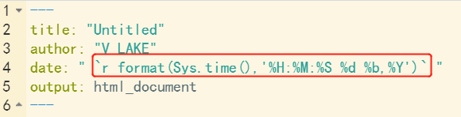
```
```yaml
---
title: "Untitled"
author: "V LAKE"
date: " `r format(Sys.time(),'%H:%M:%S %d %b,%Y')` "
output: html_document
---
```

- **Format Options**    

> **Numeric:**      
  `%H` : Hour;  `%M` : Minute;  `%S` : Second;  `%Y` or `%y` : Year; `%m` : Month; `%d` : Day     
  **Text:**      
  `%A` or `%a` : Weekday; `%B` or `%b` : Month(e.g., January or Jan)  

### Add Table-of-Content & CSS 

```{r,out.width = "31%", fig.align = "left", echo = FALSE}
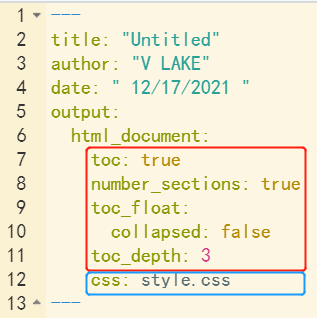
```
```yaml
---
title: "Untitled"
author: "V LAKE"
date: " 12/17/2021 "
output: 
  html_document:
    toc: true
    number_sections: true
    toc_float: true
    toc_depth: 3
    css: style.css
---
```
### Customize fonts and colors      

- Create a text file and name it as `style.css` then link it in YAML header.
- `.css` file should be in the same directory as `.Rmd` file
    
```css
#TOC {
  color: #B8860B;
  font-family: Agency FB;
  font-size: 16px;
  border-color: #708090;
}
#header{
  color:red;
  opacity: 0.8;
}
body{
  color:green;
  font-size: 10px;
}
pre{
  color:blue;
  background-color: #eab676;
}
```
```{r,out.width = "80%", fig.align = "left", echo = FALSE}
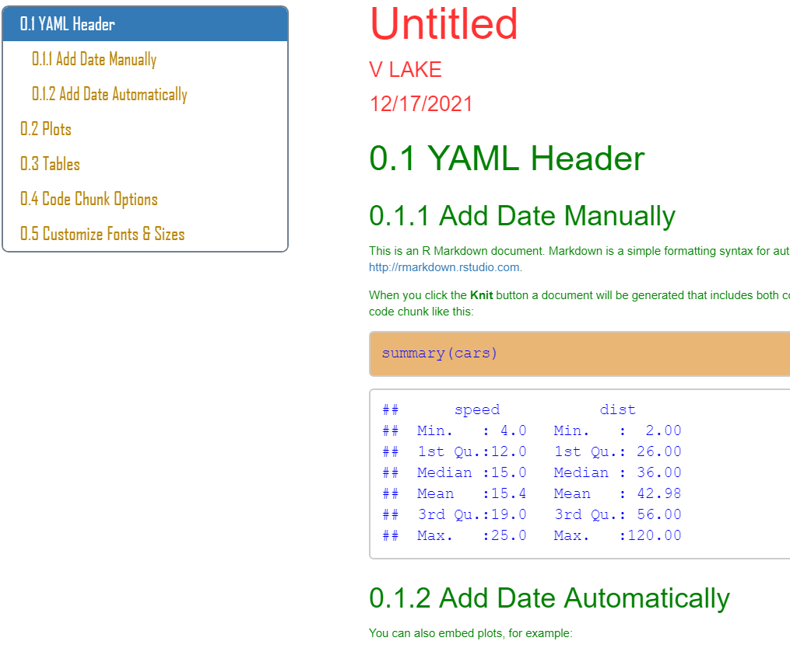
```

### Add Parameters

```{r,out.width = "50%", fig.align = "left", echo = FALSE}
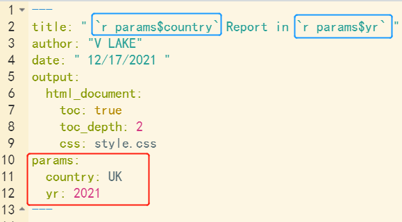
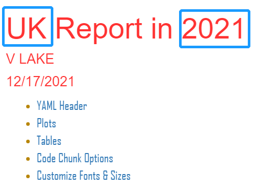
```

> Add <` name : value` > under **params:** in YAML header          
  Invoke the parameters in YAML header's **title**, **Text** body and **Code** chunk.

```{r,out.width = "70%", fig.align = "left", echo = FALSE}
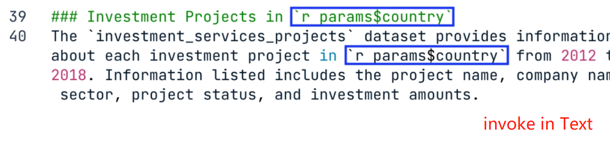
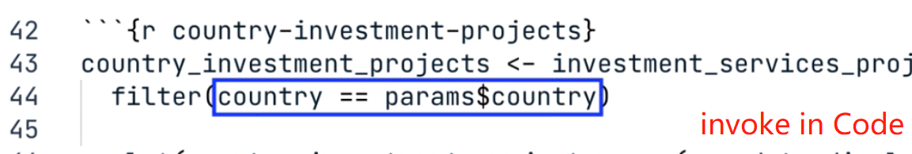
```
## Plots

### Figure arguments

```{r,out.width = "60%", fig.align = "left", echo = FALSE}
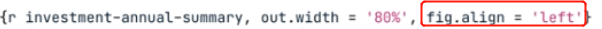
```
> **Fig Size**      
  1. `fig.width=` 5,` fig.height =`3  **OR**      
  2. `fig.dim =` c(5,3)  **OR**      
  3. `out.width =`' % ',`out.height =`' %'     
  **Fig Alignment** : ` fig.align = 'left'/'center'/'right' `       
  **Fig Caption** : ` fig.cap = 'xxx' `

### Set Options Globally

- `knitr::opts_chunk$set`( **setting**, echo= TURE)    
- **setting** before `echo =`  is the global settings

```{r,out.width = "60%", fig.align = "left", echo = FALSE}
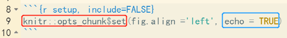
```

## Add Tables

> Use **kable( dataset, args )** in r code chunk.     
  arguments include:         
`col.names = c("col1","col2","col3" ) `      
`align = "ccc" `         
`caption = " " `   
  
```{r,out.width = "70%", fig.align = "left", echo = FALSE}
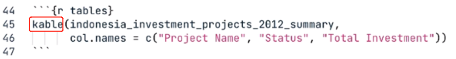
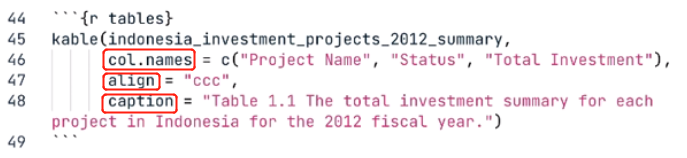
```

## Code Chunk 

### Options 

```{r,out.width = "60%", fig.align = "left", echo = FALSE}
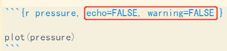
```

> **Code & Output Result **       
  1. `include = FALSE` :      
  show nothing, but run in background .           
  e.g., import library, dataset / setup global options/ exclude messages         
  2. `echo = FALSE` : only show result ( no code ), e.g., plotting         
  3. `eval = FALSE` : only show code ( not run, no actual impact by the code )           
  4. `collapse = FALSE` : combine code & result together in same area (by default, they are separated )      
  **Message,error,warning ** default :        
  1. `warning /message = TRUE`      
  2. `error = FALSE` ( if encounter error, stop knitting )

### Load Packages

```{r,out.width = "60%", fig.align = "left", echo = FALSE}
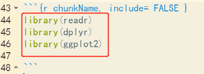
```


  
  


