<style>
#TOC {
  color: #7B1FA2;
  font-family: Agency FB;
  font-size: 20px;
}
body{
  color: #7B1FA2;
}
</style>

```{r,  fig.align = "center",  echo = FALSE}

```  
## Installation


Highly recommended to install it through [Miniconda](https://docs.conda.io/en/latest/miniconda.html) or Anaconda, since they are packed with Python so that you can skip installing python then associating it as the interpreter or kernel. 
For instance, if go to Miniconda's page, you can directly choose the right Python version to download Miniconda. 

```{r,  fig.align = "left", fig.cap ="Windows Installer for Miniconda with Specific Python Version", echo = FALSE}
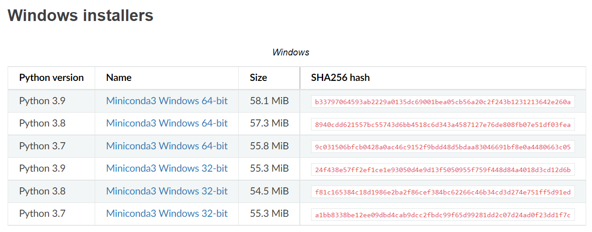
```  

## Run JN     

### through Conda 

While my studying python in University, the professor skipped the tool part totally. For a long time, the way I run Jupyter Notebook is through running Anaconda's Navigator, which is restrictive in terms of the root path or how flexible you want to manage your files. 

```{r,  fig.align = "left", fig.cap ="Run Jupyter Notebook through Conda's Navigator UI", echo = FALSE}
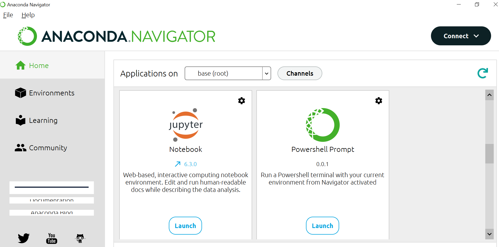
```  

> by default, Conda will be installed in **C:\\Users\\xx **. The root path of JN will be the same if you open it through Conda's Navigator. 

### Change Root Path

```{r,  fig.align = "center", fig.cap ="Open Conda's Shell", echo = FALSE}
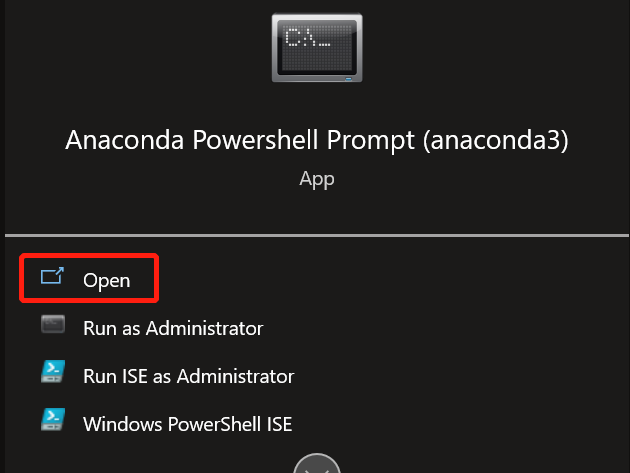
``` 

- open **AnaConda Powershell Prompt**. 
- change the directory to wherever you want to act as the root path.
- run command: ` jupyter notebook `.

```{r,  fig.align = "center", fig.cap ="Run Jupyter Notebook through Conda's Shell", echo = FALSE}
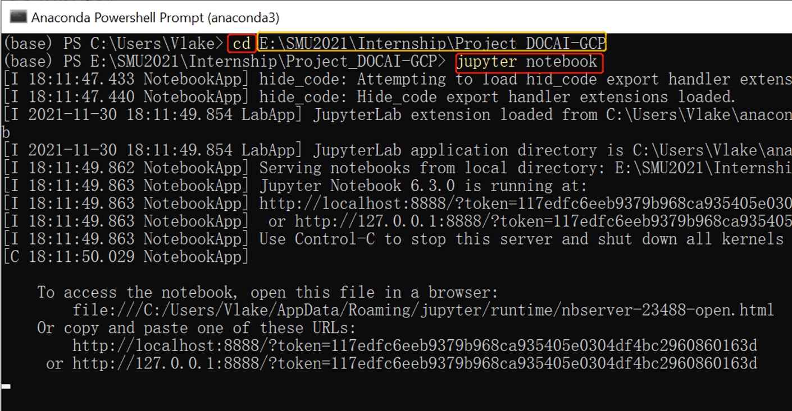
``` 

- once the JN is open in web browser, **tree** tells it is in root now, where you can start `New` files or folders, of which any action will be shown exactly the same in the file system. 

```{r,  fig.align = "center", fig.cap ="Set any Directory as Jupyter Notebook's Root path", echo = FALSE}
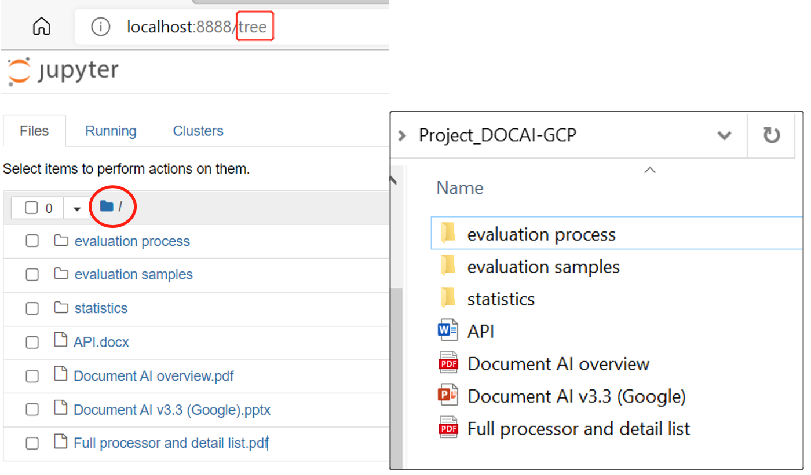
``` 


## Know Jupyter Notebook

> These are not official definition of JN, but some personal understandings which helped me in learning and working

### Basics    

1. **web-based** computational environment for creating notebook documents (formally `ipython` notebook, that's why its extension is `.ipynb`. Btw, the name jupyter is said to refer to 3 languages: Ju = `Julia`, Pyt = `Python`, the 3rd is `R` ).    
2. a notebook is a **JSON** document( you can see it if you use any other python editor such as Spyder to open `.ipynb` file).   
3. Jupyter **Kernel** is the program handling the relevant requests and response.     

```{r,  fig.align = "left", fig.cap ="Kernel -Python 3 ", echo = FALSE}
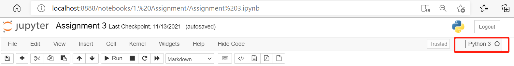
```       
4. codes or texts are written inside **Cell** of which there are 2 types: `Code`, `Markdown`. If you click any cell, the type will be shown here.   

```{r,  fig.align = "left", fig.cap ="Cell Type ", echo = FALSE}
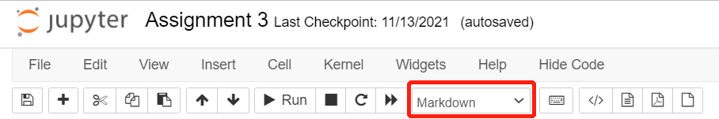
```    
### dir()

by Python kernel, a notebook is run together with a python instance, which maintains all the variables and functions ever executed in code cells within a notebook, **even after the cell is deleted**. Those variables will stay there until they are explicitly deleted or shutdown the notebook (kernel).     

> use `dir()` in code cell can check what variables and methods are available in the current python instance.  
use '`del` var' to explicitly delete a variable from current python instance.

notebook will only care about the **sequence of execution** rather than the sequence a cell is positioned ( e.g.,insertion ).    

### Shutdown JN  
closing the tab dose not equate shutting it down, as python will still run at the backend, tracking all variables and methods in the memory, when you reopen it and run a code cell, the execution order continues.      

> so , the notebook continues running until you explicitly shut it down.  

```{r,  fig.align = "left", fig.cap ="Shutdown Jupyter Notebook ", echo = FALSE}
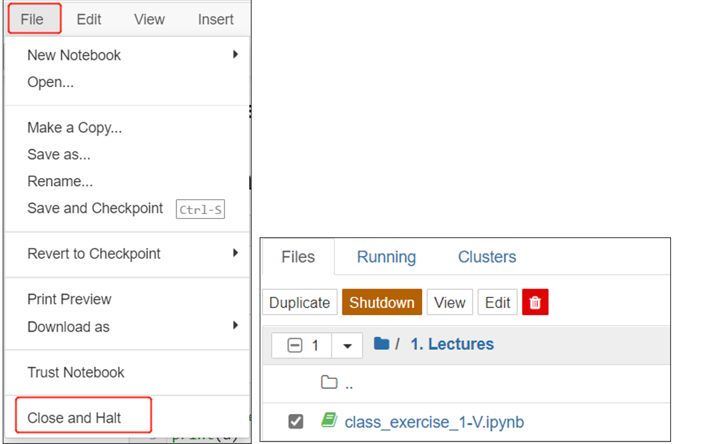
``` 

### Check Keyboard Shortcuts    
in a `.ipynb` file, you can check all the shortcuts key under tab " **Help** ".

```{r,  fig.align = "left", fig.cap ="check shortcuts ", echo = FALSE}
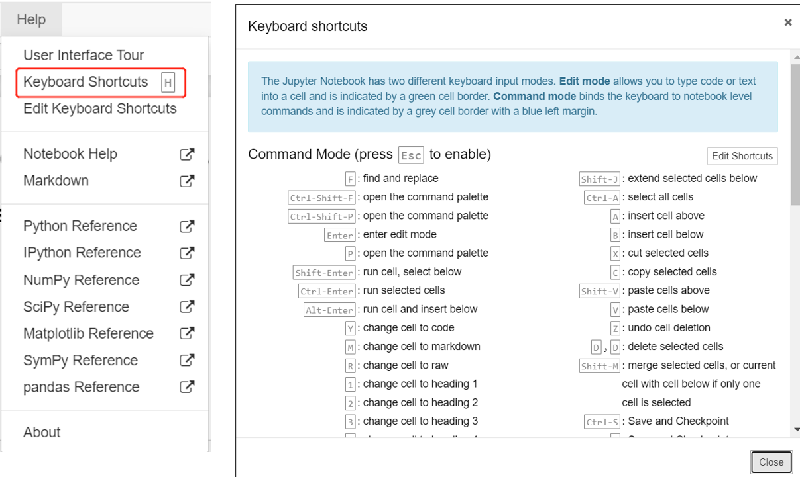
``` 


## Life-easing Things

### Shortcuts 

| COMMAND MODE                         | press 'Esc' to enable   |
|--------------------------------------|-------------------------|
| insert one cell bf current cell      |           'a'           |
| insert one cell aft current cell     |           'b'           |
| delete current cell                  |   'dd'(hit 'd' twice)   |
| change current cell to Markdown cell |           'm'           |
| save notebook                        |           's'           |
| **EDIT MODE**                            | **press 'Enter' to enable**|
| run cell, select below               |    'shift' + 'Enter'    |
| undo                                 |      'ctrl' + 'z'       |
| code completion or indent            |          'tab'          |

### Commands

1. to check the directory of current notebook: `ls`    

```{r,  fig.align = "center", fig.cap ="List contents of directory of current Jupyter Notebook ", echo = FALSE}
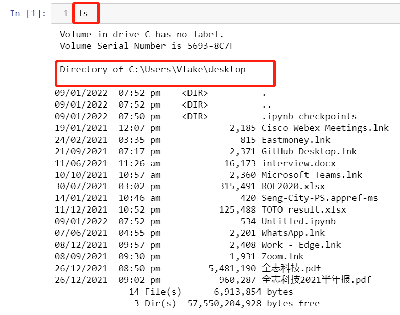
``` 

2. to run bash/terminal commands in code cell:  **by starting with  ` ! `** , for example, 

```{python, python.reticulate= FALSE,  eval=FALSE }
! pip install seaborn
```

### Extension: Hinterland

One of my favorite extension of JN is "Hinterland" which will display all the possible commands when you are typing and allow you to read the detailed document of the commands.

#### Installation

1. run two commands one by one in cmd terminal or in JN (with **!** )   

```{python, python.reticulate= FALSE,  eval=FALSE}
pip install jupyter_contrib_nbextensions    
jupyter contrib nbextension install --user   
```

2. restart JN,enable the extensions desired (` Hinterland` )        

```{r,out.width = "80%",  fig.align = "center", fig.cap ="Nbextensions ", echo = FALSE}
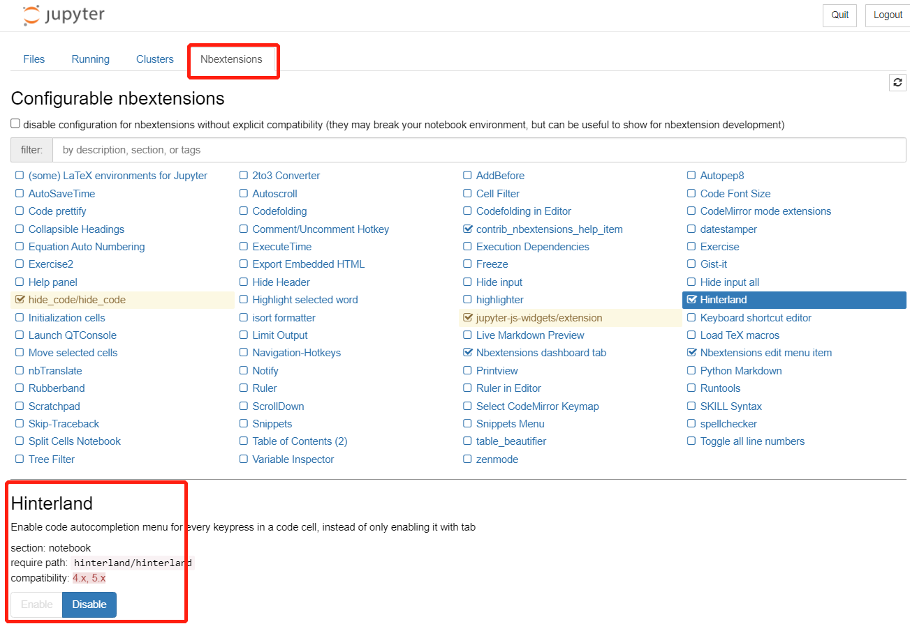
``` 

#### Usage

- read documentation of the commands when type code in JN.

```{r,  out.width = "60%", fig.align = "center", fig.cap ="Check Doc of Command", echo = FALSE}
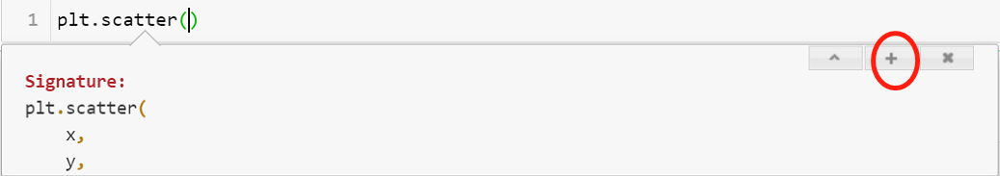
``` 

> when the curser is in the bracket of the command, key in **Shift + Tab**.     
  click the **' +' ** on the upper-right corner to expand the pane. 
  
## Export JN to PDF

A Jupyter Notebook can be converted to a number of open standard output formats (HTML, LaTeX, PDF, Markdown, Python) through **"Download as"** in the web interface.

```{r,  fig.align = "center", fig.cap ="Convert Jupyter Notebook to other formats ", echo = FALSE}
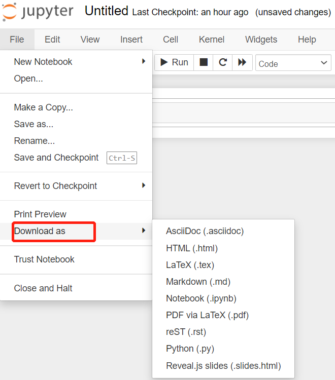
``` 

### Packages to Install     

To make it work, **nbcovert** library and its underlying packages need to be installed. [*read detail*](https://nbconvert.readthedocs.io/en/latest/install.html)    

| step | library                   | method                             | comment              |
|------|---------------------------|------------------------------------|----------------------|
| 1    | nbconvert                 | pip install nbconvert              | shell cmd            |
| 2    | Pandoc                    | https://pandoc.org/installing.html | windows installation |
| 3    | Tex ( MikTex for windows) | https://miktex.org/download        | windows installation |
| 4    | Pyppeteer Chromium        | pip install nbconvert[webpdf]      | shell cmd            |

### Unexpeted Error

after going through the 4 steps above and we happily trying to convert a notebook to pdf, we may unexpectedly see this message:

```{r,  fig.align = "center", fig.cap =" Error Msg ", echo = FALSE}
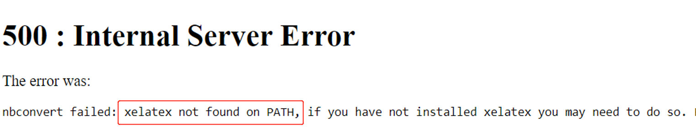
``` 

### Solutions   

1. go to **This PC** > **Advanced system settings** > **Environment Variables**, add in the path of  MikTex executable.

```{r,  fig.align = "center", fig.cap ="Add MikTex into Environment Variable ", echo = FALSE}
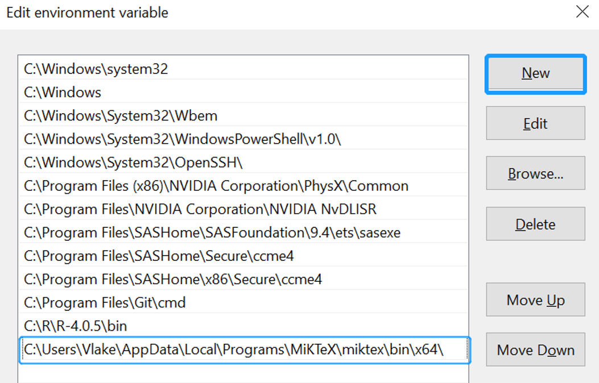
``` 

2. restart computer, relaunch JN, retry to "Download as .pdf", then several **'Package Installation'** windows will pop out, all clicking `Install`.     

```{r,fig.align = "center", fig.cap ="a Series of Package Installation", echo = FALSE}
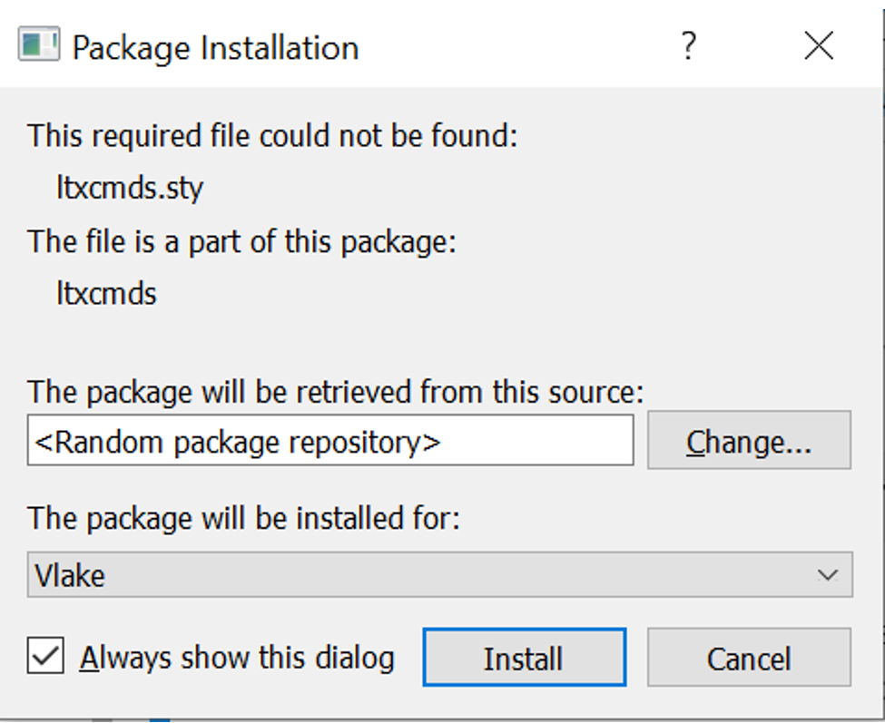
``` 

## Make JN a code-free document

There might be times that you want to share the data analyzing results to your boss who does not need to know all the codes you use. You need **hide the code**.       
There exists this **hide_code extension for JN**  to selectively hide code, prompts and output with PDF and HTML exporting support, making a notebook a code free document for exporting or presenting.     
Follow two steps to make this extension work :     

1. go to this [*hide_code extension *](https://github.com/kirbs-/hide_code) to see the demo and make sure you already meet the last **Requirements** part.    
Normally, **pdfkit** is already installed, you can try `pip` command in an open `.ipynb` file to check out. 

> `! pip install pdfkit`  

Normally, **wkhtmltopdf** needs to be installed and `Environment Variable` may also need to be added after installation. Check [*wkhtmltopdf download*](https://wkhtmltopdf.org/downloads.html)    

2.  run 4 shell commands which are stated also in this [*hide_code extension *](https://github.com/kirbs-/hide_code) under "Jupyter Notebook Installation" section.  

> `pip install hide_code`   
`jupyter nbextension install --py hide_code`
`jupyter nbextension enable --py hide_code`
`jupyter serverextension enable --py hide_code`

## Resources

1. [*built-in magic commands*](https://ipython.readthedocs.io/en/stable/interactive/magics.html)   
2. [*nbconvert: Convert Notebooks to other formats*](https://nbconvert.readthedocs.io/en/latest/)   
3. [*nbformat: Python API for working with notebook files*](https://nbformat.readthedocs.io/en/latest/api.html)   
4. [*papermill: parameterizing and executing Jupyter Notebooks*](https://papermill.readthedocs.io/en/latest/)    
5. [*nbextentions*](https://github.com/ipython-contrib/jupyter_contrib_nbextensions)    
6. [*nbviewer: a way to share Jupyter notebooks via the browser*](https://nbviewer.org/)


