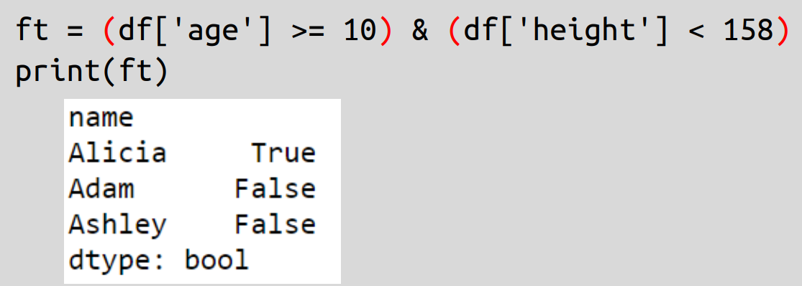
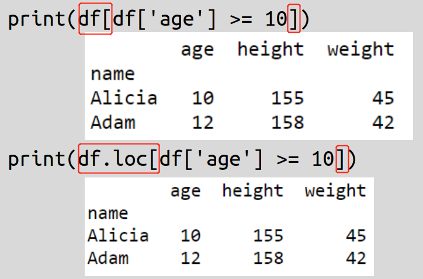
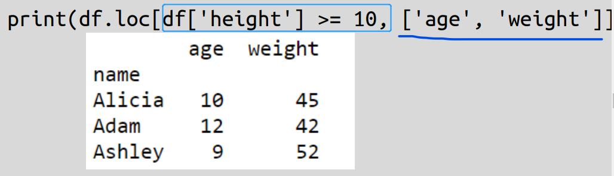
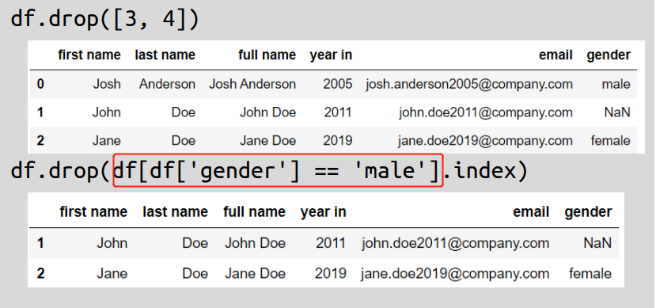
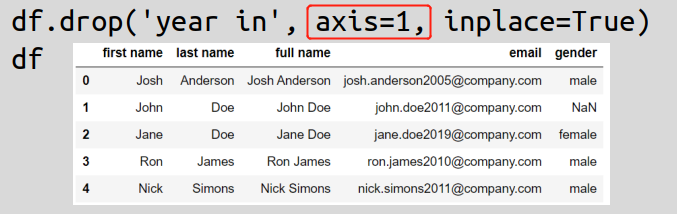
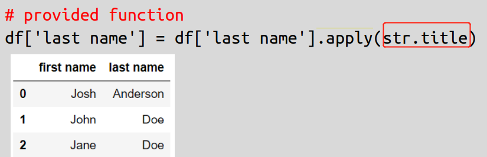
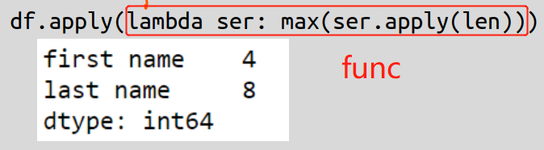
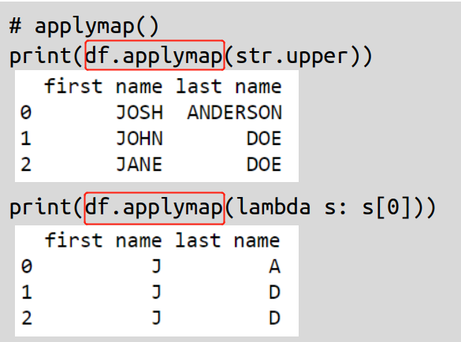

<style>
#TOC {
  color: #3483eb;
  font-family: Agency FB;
  font-size: 20px;
}
body{
  color: #3483eb;
}
</style>

```{r, fig.align = "center",fig.cap="Python ANd Data AnalysiS ?", echo = FALSE}

```

# Data Structure Attributes

Basically, numpy vector/ matrix provides the data to which pandas Series/ DataFrame adds the index and columns(names). 

```{python, python.reticulate =FALSE,eval =FALSE}
import numpy as np
import pandas as pd
```

| np<br>(np.array) | pd<br>(pd.Series) | pd<br>(pd.DataFrame) |
|:----------------:|:-----------------:|:--------------------:|
| .dim             | .index            | .index / columns     |
| .shape           | .values           | .dtypes              |

For **df** `= pd.DataFrame`,    

- `df.index` represents row-index, `df.columns` for column-index, both are **index object**.

- `df.index` is element immutable, but can be replaced entirely.

- if want to set one column's value as row-index : **df.set_index**( col_name, inplace = True  )

- if want to rename columns : **df.rename(columns =**{mapping `'old'`: `'new'`} **)**

# Methods

## pd.Series   

### Create

```{python, python.reticulate =FALSE, eval =FALSE}
pd.Series(val, index = )
```

- val can be: 
list, ndarray, dictionary( keys to be index), scalar (replicate to match index size )    
- Index can be duplicates, non-numbers    

### unique value

```{python, python.reticulate =FALSE, eval =FALSE}
import numpy as np

# return a list of unique value
np.unique( Series )
Series.unique()

# return both the value and respective counts
(unique_val,counts ) = np.unique( Series, return_counts = True)
Series.value_counts()
```

### Sort

```{python, python.reticulate =FALSE, eval =FALSE}
 pd.Series.sort_values( ascending = , inplace = )
```

### Remove Item(s)

> pd.Series.drop( index/ **[ indices ]** )   

```{python, python.reticulate =FALSE, eval =FALSE}
df['gender'].drop( [3, 4] )
```

### Replace items   

```{python, python.reticulate =FALSE, eval =FALSE}
pd.Series.map( mapping )     
pd.Series.replace( mapping )
```

- **mapping** is in form of dictionary, 'key' is replaced by 'value'.   
- if item in series **not found** in the mapping ( key ):       
    - `series.map()` turn item (*in original Series*) into **NaN**;    
    - `series.replace()` leaves the item unchanged

### Operate on Items

```{python, python.reticulate =FALSE, eval =FALSE}
Series.apply( func_name )
```


## pd.DataFrame

### Access by either Col-or-Row

- Column View

> single column :   **df.col**  or  **df[ col ]**   
multi-columns:    **df[ [col1, col2, col3...] ]**


- Row View

> by row_number :   
  single-row : **df.iloc[ row_num ]**   
  multi-rows:   
  using list: **df.iloc[ [ r_#1, r_#2...] ]**   or using slicing:  **df.iloc[ slicing ]**   
  
notice: slicing refers to **start_row_num: end_row_num**, end row_num excluded
               
> by row_name:  **df.loc[ row_name ]**   
  where row_name could be : single row_name, list of row names, or slicing  
  
notice : slicing refers to **start_row_name : end_row_name**, where end_row_name is **included** 

### Access by both Col-and-Row

1. by both Col_num AND Row_num       

> **df.iloc[ row_num, col_num ]**         
where clo_num, row_num can be: single number/ list/ slicing   

2. by both Col_name AND Row_name

> **df.loc[ row_name, col_name ]**      
where clo_num, row_num can be: single number/ list/ slicing 


### Data Selection with Filtering

#### filter_mask: similar to Boolean masking

- **df[ col ]** 的Logic operation, 可多个: and " **&** "，or " **|** "，not " **~** " .    

```{python, python.reticulate =FALSE, eval =FALSE }
ft = ( df['age'] >= 10) & (df['height'] < 158)
```

- this filter_mask returns a **Boolean Series** whose `index` are the same as **df.index**

```{r,out.width = "60%", fig.align = "center", echo = FALSE}

``` 

#### Syntax of data selection

1. do **not** specify Columns (filtered index for **all** columns ):      
   **df[ filter_mask ]**   or    **df.loc[ filter_mask ]**    
   
```{r,out.width = "60%", fig.align = "center", echo = FALSE}

``` 

2. specify columns ( filtered index with selected columns ):  
   **df.loc[ filter_mask, [ cols ] ]**    

```{r,out.width = "60%", fig.align = "center", echo = FALSE}

``` 

### Sort    

1. Sort Index

```{python, python.reticulate= FALSE,  eval=FALSE}
df.sort_index( inplace = True )
```  

2. Sort Value

```{python, python.reticulate= FALSE,  eval=FALSE}
df.sort_values( by =['col_x', 'col_y', 'col_n' ], ascending =[ True, False, True], inplace =True )
```  

### Drop Row/Column

1. remove rows:  **df.drop**( index /[ indices ] )

```{r,out.width = "60%", fig.align = "center", echo = FALSE}

``` 

2. remove columns: **df.drop**( col_, **aixs** = 1 )        
   or **aixs = 'columns'**

```{r,out.width = "60%", fig.align = "center", echo = FALSE}

``` 
notice: **inplace** parameter can be used to change the original Series/DataFrame

### Groupby then do something

**df.groupby( by =[ col1, col2, ..])**.`function`()

```{python, python.reticulate= FALSE,  eval=FALSE}
df.groupby(by =['gender']).mean()
```             

### append, concat

```{python, python.reticulate= FALSE,  eval=FALSE}
# concatenate columns/ DataFrames, columnwise
pd.concat( [df1, df2], axis =1 )

# append rows/ DataFrames, rowwise
df1.append( df2 )
```    

## Series.apply() V.S DF.apply()

|                     |                                                       |
|---------------------|-------------------------------------------------------|
| s.apply( **func_name** )  |  apply function to **each element** in the Series         |
| df.apply( **func_name** ) |  function applies on **each column or each row** of the DataFrame |

- where **func_name** can be : built-in name / self defefined function name / lambda    

```{r,out.width = "60%", fig.align = "center", echo = FALSE}

``` 

```{r,out.width = "60%", fig.align = "center", echo = FALSE}

``` 

- result returns a **Series** for both `s.apply()` or `df.apply()`

### DataFrame.apply( )

|                         |                                     |
|-------------------------|-------------------------------------|
|     df.apply( func )    | apply function **column by column** |
| df.apply(func, axis =1) | **row by row**                      |

- result returns a **Series** 

```{python, python.reticulate = FALSE, eval =FALSE}
# row by row, if col0's value is NULL, reassign value as Expression,
#             otherwise,  stay the same
df['col0'] = df.apply( lambda row: Expression  
                                   if np.isnan(row['col0']) else row['col0'],
                       axis =1)

```

### DataFrame.applymap( )   

- function applies to each element in the DataFrame   
- result is still a **DataFrame**

```{r,out.width = "60%", fig.align = "center", echo = FALSE}

```

## Correlation of data

| _corr matrix btw all columns_ | _specific columns_                 |
|-------------------------------|------------------------------------|
| df.corr()                     | _df['col1'].**corr**( df['col2'])_ |

## Missing value

|                                        |                                   |
|----------------------------------------|-----------------------------------|
| **df.isnull().sum()**                  |                                   |
| **df.dropna()**                        | _remove rows with missing value _ |
| **df['col'].fillna**( val, inplace = ) |                                   |

## Plotting

|                                               |                                                                       |
|-----------------------------------------------|-----------------------------------------------------------------------|
| _histogram of specific column/attribute_ | **df['col'].plot**( kind ='hist', bins = , figsize =(, ), title= ' ') |
| _line plot of specific column_                | **df['col'].plot()**                                                  |
| _smoothing line plot of specific column_      | **df['col'].rolling(n).mean().plot()**                             |
| _scatter plot X-Y_                            | **df.plot**( kind='scatter', x='X', y='Y', title=' ')                  |
| _boxplot of numeric column by cat_column K_  | **df.boxplot**( column = 'col', by ='K' )                             |

# Documentation

<https://pandas.pydata.org/pandas-docs/stable/reference/index.html>