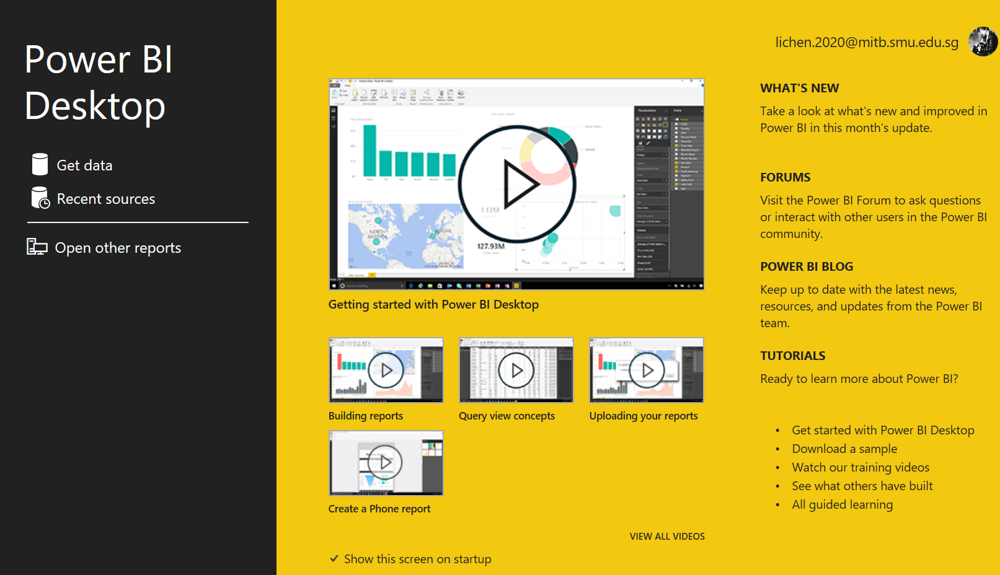

<style>
#TOC {
  color: #873e23;
  font-family: Agency FB;
  font-size: 20px;
}
body{
  color: #873e23;
}
</style>

```{r, out.width = "60%",fig.align = "center", echo = FALSE}

```

## ETL :Power Query Editor 

## Modelling 

## DAX Measures


