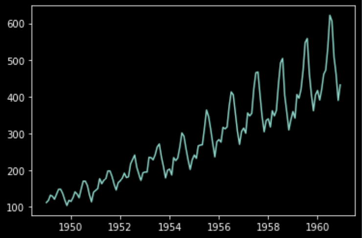

<style>
#TOC {
  color: #00b2ca;
  font-family: Agency FB;
  font-size: 20px;
}
body{
  color: #3483eb;
}
</style>


## Pyplot

*[matplotlib.pyplot   documentation](https://matplotlib.org/stable/api/_as_gen/matplotlib.pyplot.html)*

```{python, eval =FALSE}
from matplotlib import pyplot as plt
```

```{r, out.width = "100%",fig.align = "center", echo = FALSE}
knitr::include_graphics("pics/1st.png")
```

### plots
|                  | **single/ axis**   |
|------------------|--------------------|
| _Histogram_      | plt/ax.**hist**( )     |
| _Line_           | plt/ax.**plot**( )     |
| _Bar plot_       | plt/ax.**bar**( )      |
| _Box plot_       | plt/ax.**boxplot**( )  |
| _Scatter plot_   | plt/ax.**scatter**( )  |
| _Contour_        | plt/ax.**contour**( )  |
| _Filled contour_ | plt/ax.**contourf
| _add a vertical line across the axes_ | plt.**axvline**( ) |
| _add a horizontal line across the axes_ | plt.**axhline**( ) |
| _Fill the area between two horizontal curves._ | plt.**fill_between**(x, upper, lower ) |


### layouts

|                                                          | **single axis**                                                                           | **subplots**                                                                         |
|----------------------------------------------------------|-------------------------------------------------------------------------------------------|--------------------------------------------------------------------------------------|
| _Set X/Y axis range_                                     |     plt.**xlim**( )     plt.**ylim**( )                                                           |     ax.**xlim**( ) ,  ax.**ylim**( )                                                        |
| _show legend_                                            |     plt.**legend**( )                                                                          |     ax.**lengend**()                                                                     |
| _properties_                                             |     plt.**title**(''), plt.**xlabel**(), plt.**ylabel**(),   plt.**yscale**(‘log’)     plt.**grid**(True) |     ax.**set**( title='', xlabel='', ylabel='')     plt.**suptitle**('') _---overall   title_ |
| _customize ticks (change x to labels)_                   |                                                                                           | (plt/ax).**set**( xticks= x , xticklabels= labels )                                      |

### set plot-object property

> **plt.setp**( )

```{python, eval =FALSE}
obj = plt.plot(a, b, linewidth=5.0)
plt.setp( obj, color='r', linewidth=4.0)
```

### plot on dark background

```{python, eval =FALSE}
plt.style.use('dark_background')
```

```{r, out.width = "60%",fig.align = "center", echo = FALSE}

```


## Seaborn

*[seaborn documentation](https://seaborn.pydata.org/index.html)*

> (similar to pyplot), sequential `sns.xx` plot upon each other.    
   use pyplot to set up figure, layout . 


```{python,eval =FALSE}
import seaborn as sns
```
### plots

|                                                                               | **single**                                                                                                                                     |
|-------------------------------------------------------------------------------|------------------------------------------------------------------------------------------------------------------------------------------------------|
| _scatter with linear regression line, and individual variable’s distribution_ |   sns.**jointplot**( x =’’, y = '', kind = 'reg', data= )                                                                                       |
| _linear regression plot_                                                      |     sns.**regplot**( x =’’, y = '', data=, color=' ' )                                                                                                   |
| _scatter with regression line ( order =)_                                     |     sns.**lmplot**( x =’’, y = '', data=, order=   )                                                                                                     |
| _histogram ( frequency of numeric variable)_                                  |     sns.**histplot**( x = '', data =, kde = True, bins = )                                                                                               |
| _count plot ( count of categorical variable)_                                 |     sns.**countplot**( x =’’, data= ,   palette = ‘’ )                                                                                                   |
| _kde_                                                                         |     sns.**kdeplot**(  ,  shade = True )                                                                                                                  |
| _line plot_                                                                   |     sns.**lineplot**(  x =’’, y = '', =, data= , hue = )                                                                                                 |
| _boxplot_                                                                     |     sns.**boxplot**(  x =  , y =   )                                                                                                                     |
| _swarm plot_                                                                  |     sns.**swarmplot**( x =’’, y = '', =, data= , hue =, dodge=True)                                                                                      |
| _pari plot (all numeric variable /column)_                                    |     sns.**pairplot**( df, hue=’ ’, dropna=True)                                                                                                          |
| _pari plot( specific pairs )_                                                 |     sns.**pairplot**( df, x_vars=["col1 ",   " col2"..],  y_vars=" ", hue=’ ’,                                                      size= , aspect= )    |
| _heatmap ( matrix e.g., correlation matrix )_                                 |     sns.**heatmap**(corr, xticklabels=corr.columns,                                     yticklabels=corr.columns)                                        |

### PairGrid

- more customized pair plots     
- `"plot"` can be `plt.xx`*`, or `* `sns.xx`   

|                         |`fig` = **sns.PairGrid**`( data = , hue =,  palette = )`          | 
|-----------------------------------------------------------|--------------------------------|
| _all grids_             |     fig.**map**( plot )            |
| _diagonal grids_        |     fig.**map_diag**( plot )       |
| _non-diagonal grids_    |     fig.**map_offdiag**( plot )    |
| _upper right grids_     |     fig.**map_upper**( plot )      |
| _lower left grids_      |     fig.**map_lower**( plot )      |

### Subplots

- **`sns.`** basically is a brush which can also be used in subplots flexibly.

```{python, eval =FALSE}
plt.figure()                 # fig = plt.figure()         
plt.subplot( row, col, 1)    # fig.add_subplot( row, col, 1 )
sns.whatever_plot()
plt.subplot( row, col, 2)
sns.whatever_plot()
...
plt.show()
```

- method2

```{python, eval =FALSE}
fig, axes = plt.subplots( row, col, figsize =() )
sns.whatever_plot( args, ax= axes[0] )
sns.whatever_plot( args, ax= axes[1] )
...
fig.show()
```

## Pandas

*[pandas.DataFrame.plot   documentation](https://pandas.pydata.org/docs/reference/api/pandas.DataFrame.plot.html)*

```{python, eval =FALSE}
import pandas as pd
```

|                                               |                                                                       |
|-----------------------------------------------|-----------------------------------------------------------------------|
| _histogram of specific column/attribute_      | **df['col'].plot**( kind ='hist', bins = , figsize =(, ), title= ' ') |
| _line plot of specific column_                | **df['col'].plot()**                                                  |
| _smoothing line plot of specific column_      | **df['col'].rolling(n).mean().plot()**                             |
| _scatter plot X-Y_                            | **df.plot**( kind='scatter', x='X', y='Y', title=' ')                  |
| _boxplot of numeric column by cat_column K_  | **df.boxplot**( column = 'col', by ='K' )                             |

## some Cmaps

each 'color' has **'color_r'**

```{python}
import seaborn as sns
sns.color_palette("Accent")
```

```{python}
sns.color_palette("Accent_r")
sns.color_palette("Blues")
sns.color_palette("Blues_r")
sns.color_palette("BuGn")
sns.color_palette("BrBG")
sns.color_palette("BuPu")
sns.color_palette("CMRmap")
sns.color_palette("Dark2")
sns.color_palette("GnBu")
sns.color_palette("Greens")
sns.color_palette("Greys")
sns.color_palette("OrRd")
sns.color_palette("Oranges")
sns.color_palette("PRGn")
sns.color_palette("Paired")
sns.color_palette("Pastel1")
sns.color_palette("Pastel2")
sns.color_palette("PiYG")
sns.color_palette("PuBu")
sns.color_palette("PuBuGn")
sns.color_palette("PuOr")
sns.color_palette("PuRd")
sns.color_palette("Purples")
sns.color_palette("RdBu")
sns.color_palette("RdGy")
sns.color_palette("RdPu")
sns.color_palette("RdYlBu")
sns.color_palette("RdYlGn")
sns.color_palette("Reds")
sns.color_palette("Set1")
sns.color_palette("Set2")
sns.color_palette("Set3")
sns.color_palette("Spectral")
sns.color_palette("Wistia")
sns.color_palette("YlGn")
sns.color_palette("YlGnBu")
sns.color_palette("YlOrBr")
sns.color_palette("YlOrRd")
sns.color_palette("afmhot")
sns.color_palette("autumn")
sns.color_palette("binary")
sns.color_palette("bone")
sns.color_palette("brg")
sns.color_palette("bwr")
sns.color_palette("cividis")

```

